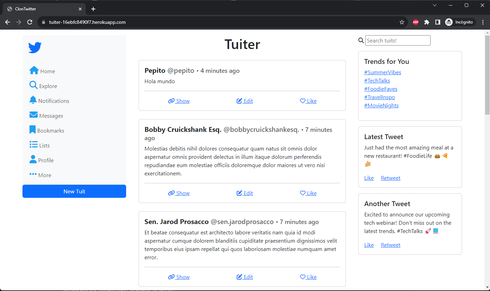

# Clon de Twitter - Desarrollo de Aplicaciones con Ruby on Rails

Este proyecto es una simulación del comportamiento básico de Twitter, implementado como parte de la prueba de Introducción al Desarrollo de Aplicaciones Web con Ruby on Rails.

## Descripción

El objetivo de este proyecto es aplicar los conceptos y herramientas aprendidas en el módulo de desarrollo web con Ruby on Rails. La aplicación simula la creación, lectura, actualización y eliminación de tweets, siguiendo la lógica de Twitter.

## Requerimientos

1. Creación de la aplicación utilizando PostgreSQL como base de datos.
2. Generación de un scaffold para las acciones de Crear, Leer, Actualizar y Eliminar un Tweet. El modelo de Tweet incluye los campos de Description y UserName.
3. Implementación de paginación en la vista index para mostrar solo 10 tweets a la vez y un botón para cargar más.
4. Implementación de un buscador de tweets.
5. Uso de Git y GitHub para el versionamiento y progresión de avances en la aplicación, con al menos 5 commits que describan los cambios realizados.
6. Despliegue de la aplicación en Heroku.

## Adicionales

- Cuando se busca un tuit, se desactiva la paginación para mostrar todos los resultados relevantes.
- Los tuits se ordenan por fecha de actualización para mantenerlos actualizados en la vista.
- Se han agregado estilos para emular la vista de Twitter y proporcionar una experiencia visual similar.
- Se agrega un método helper personalizado `generate_twitter_username` el que genera automaticamente un nombre de usuario de Twitter a partir del nombre de usuario.

## Instalación y Uso

1. Clona este repositorio: `git clone <URL del repositorio>`
2. Instala las gemas necesarias: `bundle install`
3. Configura la base de datos: `rails db:create db:migrate`
4. Ejecuta el servidor local: `rails server`
5. Accede a la aplicación en tu navegador: `http://localhost:3000`

## Capturas de Pantalla

A continuación, se muestran algunas capturas de pantalla de la aplicación:

## Tecnologías Utilizadas

- Ruby on Rails
- PostgreSQL
- Bootstrap
- Heroku

## Despliegue en Heroku

1. Crea una cuenta en Heroku si aún no tienes una.

2. Instala el cliente de Heroku en tu máquina local.

3. Inicia sesión en Heroku desde la terminal:

   ```bash
   heroku login
   ```

4. Crea una nueva aplicación en Heroku:

   ```bash
   heroku create tuiter
   ```

5. Commit y push los cambios en git:

   ```bash
   git add .
   git commit -m "Deploy to Heroku"
   git push origin main
   ```

6. Despliega la aplicación en Heroku:

   ```bash
   git push heroku main
   ```

7. En Heroku, se debe agregar el complemento "Heroku Postgres" para la base de datos.

8. Ejecuta las migraciones en Heroku y crea los datos de prueba:

   ```bash
   heroku run rails db:migrate
   heroku run rails db:seed
   ```

9. Abre la aplicación en tu navegador:

   ```bash
   heroku open
   ```

¡Felicitaciones! Si has seguido todos los pasos, deberías ver la aplicación desplegada en Heroku.

